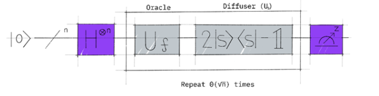
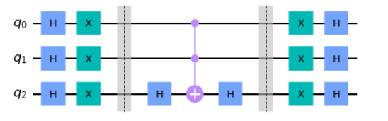
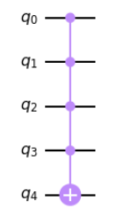
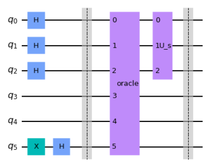
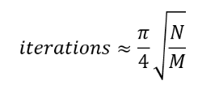

<!-- # Lab 6: Grover's Algorithm -->

Submit to Autograder by 11:55 pm Thu 2/26

[Starter Code](https://eecs479.github.io/lab-6/starter_code.zip)

[Qiskit Tutorials](https://docs.quantum.ibm.com/)

## Grover's Algorithm

For this assignment you are to implement the provided functions in `lab_6.py`. Your code must pass all the tests listed in `test.py`. The autograder will confirm if you are getting the points for the test cases. There are no hidden test cases.

You will implement Grover's algorithm to discover the input(s) that make a mystery function (implemented in `mystery_function`) true. As discussed in lecture, Grover's algorithm is implemented by iteratively applying the oracle operation and the diffuser operation.

Because the oracle is already provided for you, you only need to implement the diffuser, assemble the overall circuit, and run the experiment.



## Implementing the Diffuser

The diffuser works by rotating the state around \(\lvert s \rangle\). The lecture discussed how to do this in detail. The process is summarized below for a 3-bit circuit, but your design should work for any size.



This circuit uses `H` gates to map \(\lvert s \rangle\) to \(\lvert 0 \rangle\), maps \(\lvert 0 \rangle\) to \(\lvert 1 \rangle\) via `X` gates, flips the phase using `H` and `CCX`, before undoing the base change with a second round of `X` and `H` gates.

For generalizing the multi-controlled `X` gate, you may find the `MCX` gate helpful:

```python
qc = QuantumCircuit(5)
num_ctrl_bits = 4
mcx_state = 0b1111
gate = MCXGate(num_ctrl_bits, ctrl_state=mcx_state)
qc.append(gate, range(5))
```

The above code generates a quantum circuit which flips the state of `q_4` iff `{q_3, q_2, q_1, q_0} = 4'b1111`.



## Connecting the Circuit



The above circuit shows how Grover's algorithm should be constructed. Bits `3-4` of the oracle are used to store temporary results, so they should be initialized and left as `0`. Bits `0-2` should be set to \(\lvert + \rangle\) and bit `5` to \(\lvert - \rangle\) in order for phase kickback to work correctly. Then the phase-modified input values should be fed into the diffuser.

Because we do not know how many solutions there are to this mystery function, we do not know for sure how many times we should apply the oracle and diffuser. Ideally, we would use the quantum counting algorithm to estimate this for us, but we will save that for next time. Since this is a relatively small function with a small number of expected solutions, we can just manually try running with `1`, `2`, `3`, etc. instances of the oracle and diffuser appended and see when we get the most consistent results.

You will likely get a few random other measurements no matter how many iterations you have. This is the nature of running a probabilistic algorithm.

Once you have a circuit where you are consistently reading out the same result(s), count them up. Does the number of iterations in your circuit match the theoretical value of:



where \(N\) is the number of possible inputs and \(M\) is the number of solutions? If not, what might explain this discrepancy? (This question is rhetorical: you do not need to submit an answer.)


## Submission Notes

Implement the required functions in `lab_6.py` and verify with `test.py`. The autograder uses the same set of tests (no hidden tests).
